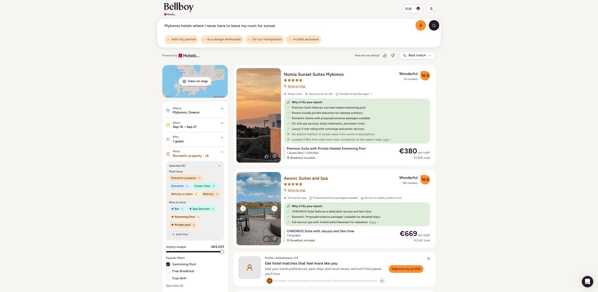
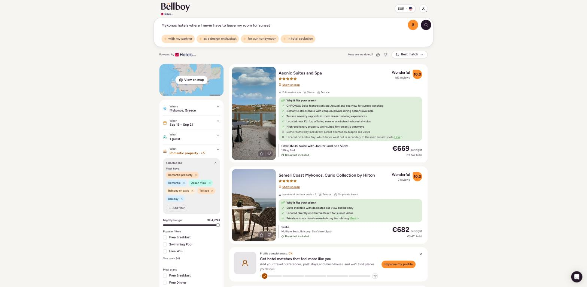
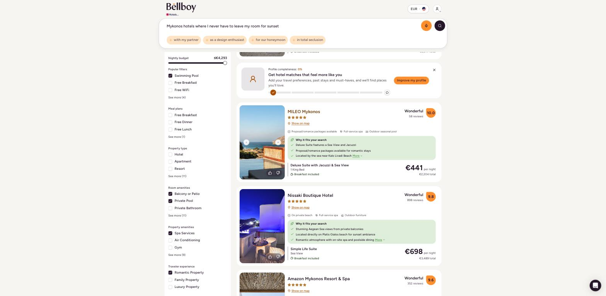
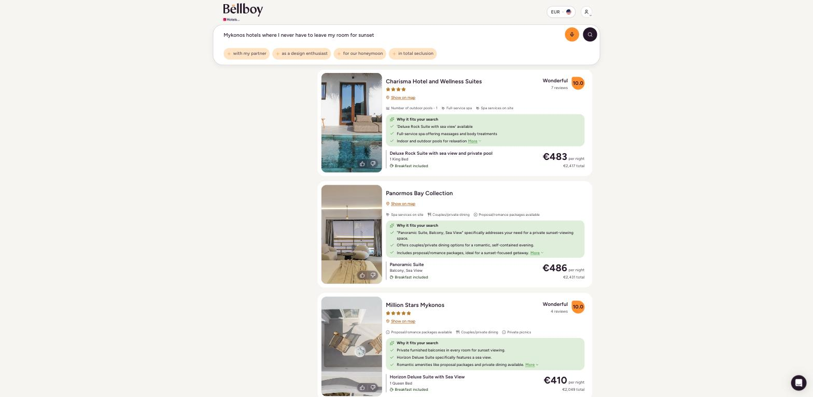

# Bellboy Repeat-Search Investigation

**Environment:** [https://hoteller-theta.vercel.app/](https://hoteller-theta.vercel.app/)  
**Scope:** Part 2 - Investigation

---

## 1. Summary

The report says that users sometimes receive very different results when repeating the same hotel search.

At this stage, I would not assume this is a bug. There could be several possible causes, including search parameters, user/session state, hotel availability, ranking logic, caching, randomness in the AI response, or backend/API behavior.

**My first goal would be to determine:** Is the same request actually reaching the system with the same inputs, and if so, why are the results different?

I would first reproduce the exact customer scenario, then compare the search pipeline stage by stage rather than assuming the cause is randomness, ranking, caching, or the AI response.

---

## 2. Information I Would Request from Customer Support

I would ask for as much detail as possible from the affected user.

**Search information**

- What was the exact search text?
- Were the searches typed manually, copied/pasted, or spoken?
- Were the searches performed immediately one after another or hours apart?
- Screenshots would be helpful.

*Why:* Natural-language systems can behave differently depending on the exact input and context.

**User/session information**

- Was the user logged in?
- Was the search performed in the same browser/device?
- Did they use incognito/private mode?
- Did they clear cookies between searches?
- Was it desktop or mobile?

*Why:* System behavior could change due to the environment.

**Result information**

- Screenshots of the different result sets
- The first few hotels shown in each search
- Match/relevance scores, if displayed
- Any filters shown in the sidebar
- Dates, guests, location, and other extracted criteria

*Why:* "Different results" could mean completely different hotels, or simply a different ranking of the same hotels.

---

## 3. Priority Order

| Priority | Finding | Why it matters |
| --- | --- | --- |
| P0 | Same query produces substantially different hotel sets | Directly reproduces the Support report |
| P1 | Reloading the same result URL shows different filters | The displayed criteria may not match the saved result |
| P2 | Root cause not yet isolated | Requires trace-level investigation |

---

## 4. What Is Known

From the Customer Support report:

- Multiple users reported inconsistent repeat searches.
- The issue is intermittent.
- One user experienced it several times in one day.
- Support has not reproduced it consistently.

"Different results" could mean different properties, ranking, prices, filters, or generated copy. I compared each of these separately rather than treating all variation as one issue.

---
## 5. Reproduction I Did

I was able to reproduce the reported behavior by submitting the same typed query in two different browser states: one normal browser window and one incognito window. Both searches produced different filter sets and different hotel results.

I was logged out in both cases, used no preset filters, and waited for all cards, images, and "Why it fits" sections to load before recording the results.

The result sets were different, rather than simply being reordered, which directly supports the behavior described by Support.

### Test Setup

I submitted the exact query below twice, once in a normal browser window and once in an incognito window.

> Mykonos hotels where I never have to leave my room for sunset

Both runs inferred **Mykonos, Sep 16-21, one guest**. The remaining output differed substantially.

### Results

| Area                      | Run 1                                    | Run 2                                                     |
| ------------------------- | ---------------------------------------- | --------------------------------------------------------- |
| Search ID                 | `01M06506H5M8W17FY1ZX4J3HN6`             | `01M065384RDFE9QC3MVJ63Y408`                              |
| Filters                   | 9; split into Must have and Nice to have | 6; all Must have                                          |
| Unique filter differences | Bar, spa, swimming pool, private pool    | Terrace                                                   |
| First result              | Nomia Sunset Suites Mykonos              | Aeonic Suites and Spa                                     |
| Properties observed       | 8                                        | 15                                                        |
| Overlap                   | 3 properties                             | 3 properties                                              |

The shared properties were Aeonic Suites and Spa, Tharroe of Mykonos, and Nomia Sunset Suites Mykonos. They appeared at different positions. Five Run 1 properties were absent from Run 2, while Run 2 showed twelve properties not observed in Run 1.

The difference is not limited to ranking movement. Only three properties appeared in both completed result sets, despite both searches using the same query text and producing the same high-level destination, date, and guest interpretation.

| Run 1 | Run 2 |
|---|---|
|  |  |

| Run 1 continuation | Run 2 continuation |
|---|---|
|  |  |

---

## 6. Assessment

The test confirms  user-visible problems:

1. **Identical query text can produce substantially different search criteria and hotel sets.** This reproduces the behavior described by Support under the tested conditions: one normal browser window and one incognito window.

The test does not prove the technical cause.

Possible areas I would investigate include:

* Natural-language interpretation
* How filters are generated and displayed
* Backend/API responses
* Hotel inventory and availability
* Ranking behavior
* Browser/session state

The fact that each search received a different result ID does not by itself explain why the results were different.

I would use the logs/traces for both searches to identify where the two searches first start to differ.

---

## 7. What I Would Do Next

### 7.1 Collect Evidence from Affected Users

Ask Support for:

* Exact query text or voice transcript
* Timestamps and request/session IDs
* Screenshots or screen recordings
* Dates, guests, filters, sort order, currency, and locale
* Device, browser, login state, and profile state
* Whether the searches were repeated in the same tab or a new session

This lets us confirm what **same** and **different** mean for each report and correlate the attempts with logs.

### 7.2 Compare the Two Searches

I would now compare the two searches using their search IDs and traces with particular attention to the difference between the normal browser and incognito browser states.

I would compare:

1. **Input:** raw query, dates, guests, filters, session context, cookies, locale, and currency.
2. **Interpretation:** parsed destination, dates, guest count, extracted filters, and model/configuration version.
3. **Inventory:** hotel IDs, availability, prices, and supplier response.
4. **Ranking:** candidate set, ranking scores, ranking model/version, and tie-breaking.
5. **Presentation:** filter chips, page title, hotel information, and displayed search criteria.

The main thing I would want to find is the **first point where the two searches differ**.

For example, if the input and interpretation are the same but the hotel IDs are different, I would investigate the inventory/API response. If the hotel IDs are the same but the order is different, I would investigate ranking. If the hotel results are the same but the filters are different, I would investigate how the filters are generated and displayed.

This would help narrow down whether the difference comes from the search interpretation, hotel inventory, ranking, browser/session state, or how the results are displayed.

### 7.3 Improve Diagnostics

If the current logs do not contain enough information, I would add logging for:

* Raw input
* Parsed intent
* Model/configuration version
* Experiment flags
* Cache status
* Supplier request ID
* Candidate hotel IDs
* Ranking scores
* Displayed filters

Ideally these would all be connected under one trace ID.

**The main thing I would want to establish is where the difference first appears.** Once that is known, it should be much easier to determine whether the issue is coming from the search interpretation, hotel inventory, ranking, browser/session state, or how the results are displayed.
